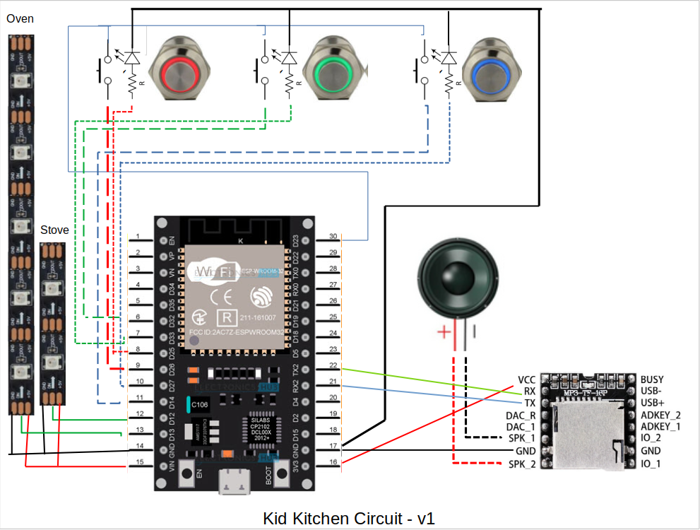
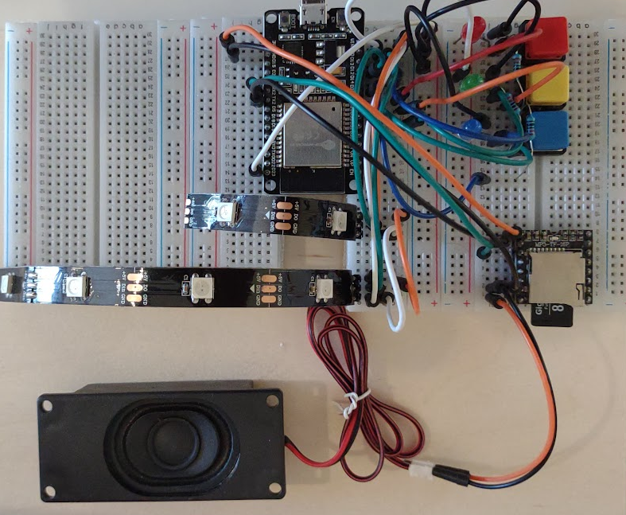

# kid_kitchen
IKEA DUKTIG re-brain

Create a wifi_secret.h file in the src directory - It should include:
```
#define SECRET_SSID "your_ssid"
#define SECRET_PASS "your_password"
```

After the initial upload via usb port, note the IP address in the output and change it for your ESP32 in the platformio.ini file


Parts:
* ESP32-VROOM-32
* MP3-TF-16P
* Switches with built-in LEDs
* Speaker
* micro SD card

Circuit diagram


Test breadboard


The SD card should contain these files:

```
├── 01_Eng
│   ├── 001_Red.mp3
│   ├── 002_Green.mp3
│   ├── 003_Blue.mp3
│   ├── 004_Yellow.mp3
│   ├── 005_Cyan.mp3
│   ├── 006_Magenta.mp3
│   └── 007_White.mp3
├── 02_Spa
│   ├── 001_Rojo.mp3
│   ├── 002_Verde.mp3
│   ├── 003_Azul.mp3
│   ├── 004_Amarillo.mp3
│   ├── 005_Cian.mp3
│   ├── 006_Magenta.mp3
│   └── 007_Blanco.mp3
├── 03_Languages
│   ├── 001_English.mp3
│   └── 002_espanol.mp3
├── 80_Snd1
│   ├── 001_fax.mp3
│   ├── 002_porche.mp3
│   ├── 003_sizzle.mp3
│   ├── 004_microwave.mp3
│   ├── 005_timer_ding.mp3
│   ├── 006_car_start.mp3
│   └── 007_diesel.mp3
├── 81_Snd2
│   └── 001_frying_egg.mp3
├── 85_songs
│   ├── 001_abc-song.mp3
│   └── 010_ants_marching.mp3
├── 86_startup
│   ├── 001_Vista.mp3
│   ├── 002_win11.mp3
│   └── 003_reactos.mp3
└── 88_buttons
    ├── 001_boing.mp3
    ├── 002_button.mp3
    ├── 003_tos_keypress1.mp3
    ├── 004_tos_keypress2.mp3
    ├── 005_tos_keypress3.mp3
    └── 006_tos_keypress4.mp3

```